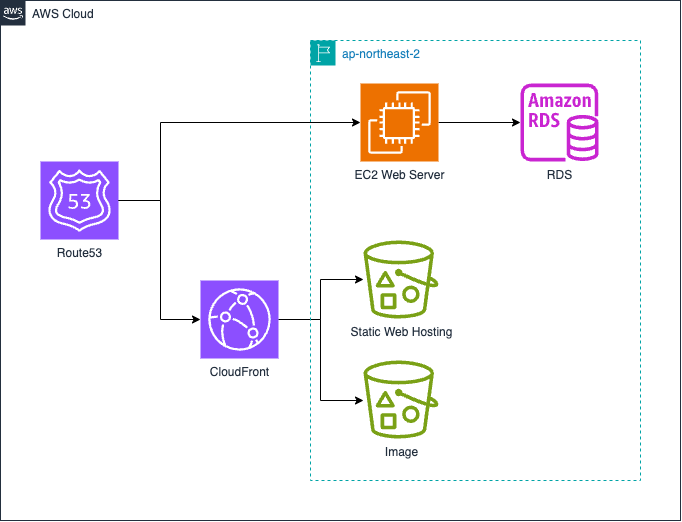

# buchi_project

## 프로젝트 개요

부장님의 취향(일명 부취 프로젝트!!)은 회식 장소 선정의 어려움을 겪는 직장인(회식 담당자)에게
기존의 장소 추천 서비스(캐치테이블, 다이닝코드)와 달리
직장 회식에 최적화된 장소를 쉽고 빠르게 찾아주는 서비스로
예산과 회식 목적에 맞는 식당을 추천하고, 팀별 회식 장소를 기록하며
회식 구성원의 취향에 적합한 장소를 제안하여
만족도를 높이고, 회식 장소 선정의 부담감을 줄이는 서비스입니다.

## 사용된 기술 스택

### 프론트엔드

- **React**: 사용자 인터페이스를 구성하는 주요 프레임워크입니다.
- **Redux**: 애플리케이션 상태 관리를 위한 도구입니다.
- **Axios**: API 통신을 위한 HTTP 클라이언트입니다.
- **ANT Design**: 빠르고 효율적인 스타일링을 위한 CSS 프레임워크입니다.

### 백엔드

- **Node.js**: 서버사이드 자바스크립트 런타임 환경.
- **Express**: 빠르고 간단한 웹 프레임워크로, 서버와 API를 쉽게 구축할 수 있습니다.
- **axios**: HTTP 클라이언트로, 서버 간의 API 통신을 비동기적으로 처리하기 위해 사용됩니다.
- **bcryptjs**: 비밀번호 해싱 라이브러리로, 사용자 비밀번호를 안전하게 저장하기 위해 사용됩니다.
- **cors**: Cross-Origin Resource Sharing을 설정하여, 다른 도메인에서 서버에 요청을 허용할 수 있도록 합니다.
- **dotenv**: 환경 변수들을 파일로 관리할 수 있게 도와주는 라이브러리입니다. `.env` 파일을 통해 환경 변수를 설정하고 사용합니다.
- **express-session**: 세션 관리를 위한 미들웨어로, 사용자 인증 및 상태를 서버에서 유지하기 위해 사용됩니다.
- **mysql2**: MySQL 데이터베이스와 상호작용하기 위한 클라이언트입니다.
- **passport**: 사용자 인증을 위한 미들웨어로, 다양한 전략(Strategy)을 사용하여 인증을 처리할 수 있습니다.
- **passport-naver-v2**: Naver OAuth 2.0 인증 전략을 위한 Passport.js 라이브러리입니다.
- **sequelize**: Node.js에서 SQL 기반의 데이터베이스를 ORM(Object-Relational Mapping) 방식으로 사용할 수 있게 해주는 라이브러리입니다. MySQL 등과 함께 사용되어 데이터를 객체로 관리할 수 있습니다.

### 기타

### 폴더 구조

```
buchi_project
├── backend
│   ├── src
│   │   ├── aws/               # AWS 관련 설정과 유틸리티 파일들
│   │   ├── config/            # 서버 설정 파일 (DB, 환경 변수 등)
│   │   ├── controllers/       # API 요청을 처리하는 컨트롤러
│   │   ├── middlewares/       # 요청을 처리하는 미들웨어
│   │   ├── models/            # 데이터베이스 모델 정의
│   │   ├── passport/          # 인증 관련 로직 (Passport.js)
│   │   └── routes/            # API 엔드포인트 정의
│   └── server.js              # 백엔드 서버의 시작점
├── frontend
│   ├── src
│   │   ├── assets/            # 이미지, 폰트 등의 정적 파일
│   │   ├── components/        # 재사용 가능한 UI 컴포넌트
│   │   ├── features/          # 상태 관리나 주요 기능 관련 로직
│   │   ├── pages/             # 각각의 페이지 컴포넌트
│   │   ├── routes/            # 라우팅 설정
│   │   ├── store/             # 글로벌 상태 관리 (Redux 등)
│   └── └── styles/            # 스타일 관련 파일 (CSS, SCSS 등)
└── docs/                      # 프로젝트 문서화
```


